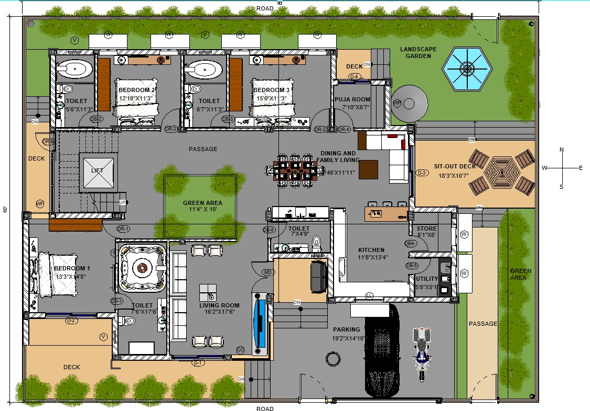
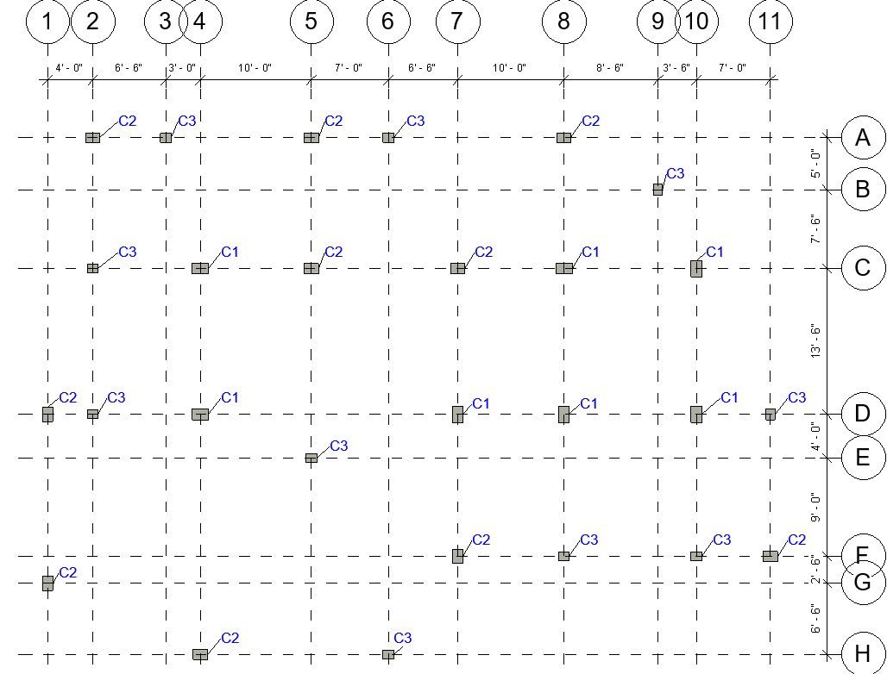
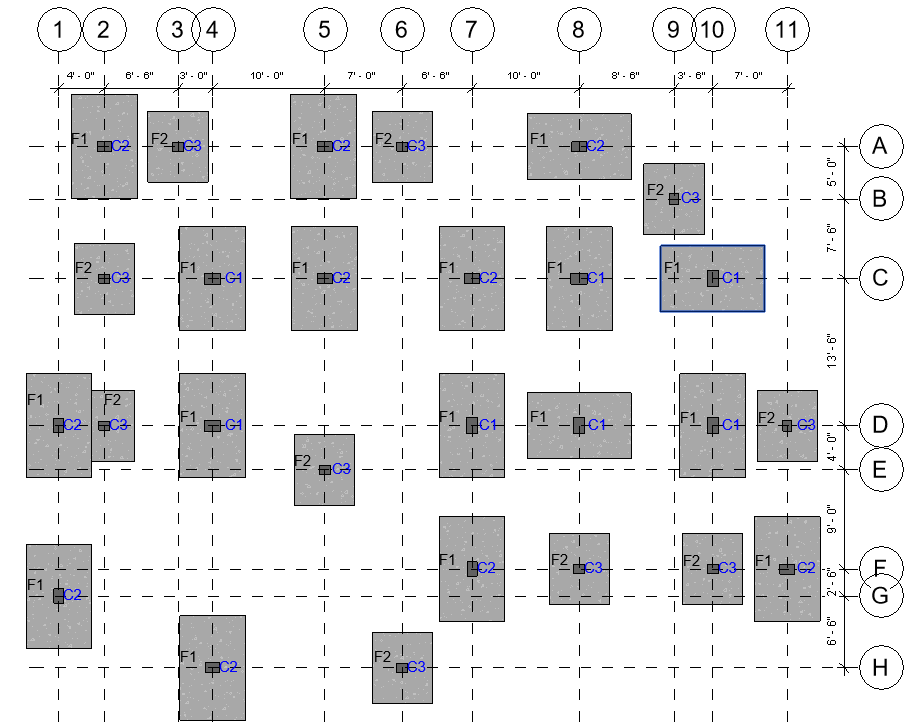
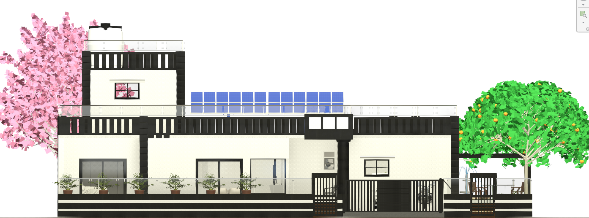
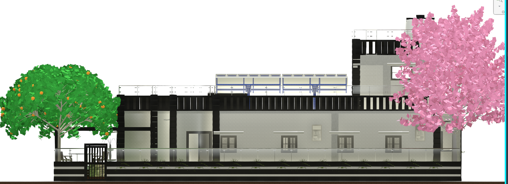
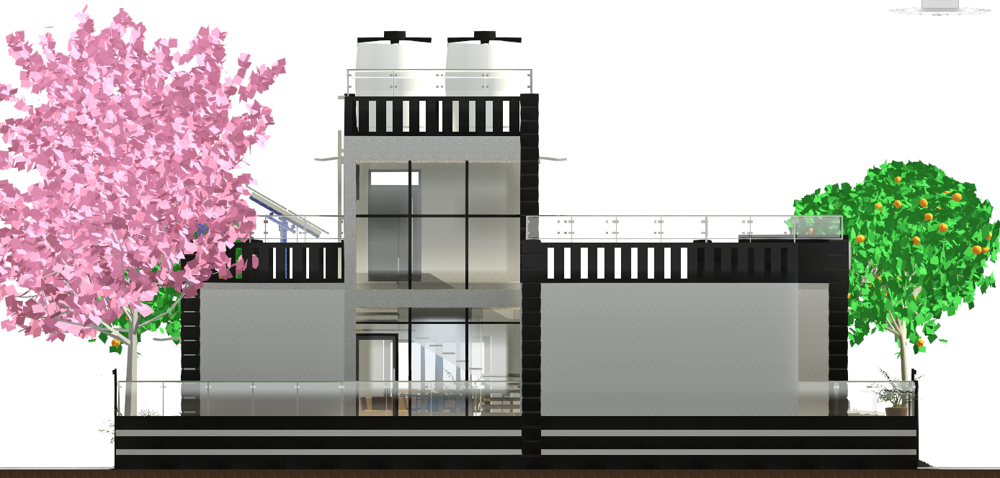
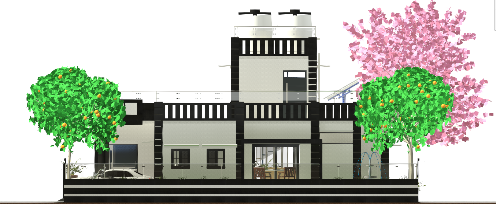
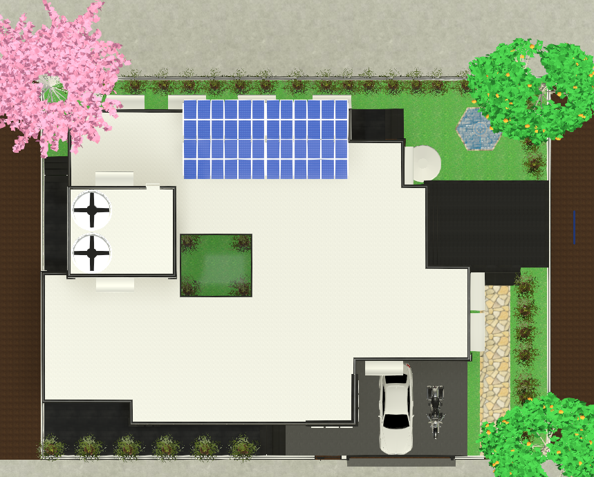
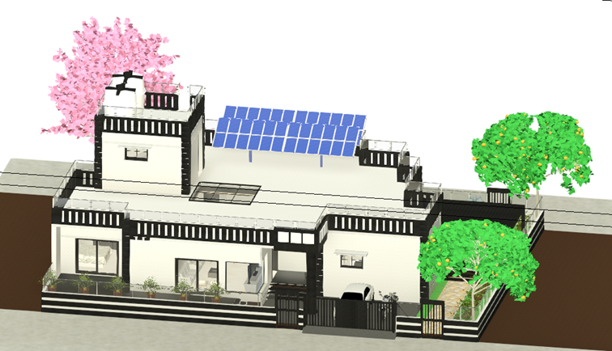
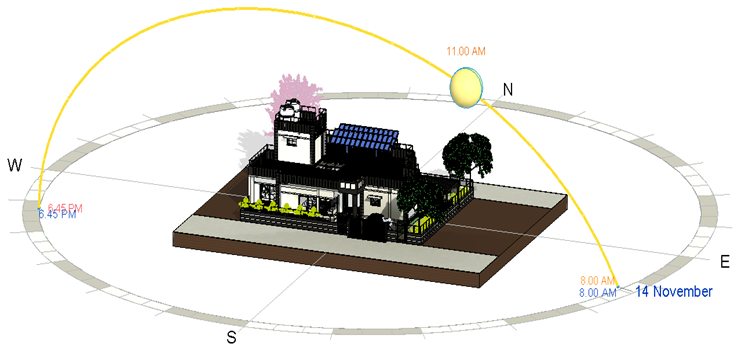

# 🌱 Green Residential Building Design – Revit

## 📌 Overview
This project focuses on the design of a sustainable residential building using Autodesk Revit. It integrates green building principles such as solar energy, rainwater harvesting, and eco-friendly materials to reduce environmental impact and improve energy efficiency.

---

## 🏗️ Key Features

- Designed for a real residential site in Jodhpur, India  
- Sun path analysis for optimal natural lighting & ventilation  
- BIM-based 2D & 3D modeling using Revit  
- Structural design: foundation, columns, beams, slabs   
- Rooftop solar panel system (5 kW)  
- Rainwater harvesting system  
- Central skylight for natural lighting  
- Eco-friendly materials (fly ash bricks, low-carbon cement)  
- Cost estimation and material quantity analysis  

---

## 🖼️ Project Visuals

### 🏠 Floor Plan

---

### 🧱 Structural Layout

#### Column Plan

#### Foundation Plan

---

### 🏗️ Elevations

#### Front Elevation

#### Rear Elevation

#### Left Elevation

#### Right Elevation

#### Top Elevation

---

### 🏡 3D View

---

### ☀️ Sun Path Analysis

---

## 📊 Project Details

| Parameter | Value |
|----------|------|
| Location | Jodhpur |
| Area | 4800 sq ft |
| Cost | ₹1.2 Crore |
| Software | Autodesk Revit |
| Energy System | Solar (5 kW) |

---

## ⚙️ Methodology

- Literature Review  
- Design Planning  
- Structural Modeling  
- BIM Development (Revit)  
- Cost Estimation  
- Sustainability Analysis  

---

## 📈 Results & Impact

- Improved energy efficiency (~25–30%)  
- Reduced water usage (~40%)  
- Sustainable and cost-effective design  
- Reduced environmental impact  

---

## 🚀 Future Scope

- Integration with smart home systems  
- IoT-based energy monitoring  
- AI-driven energy optimization

---

## 📚 Documentation

- 📄 [Project Report](./report/green-building-report.pdf)

---

## ⚠️ Note

Revit (.rvt) file not included due to size limitations. Available upon request.
